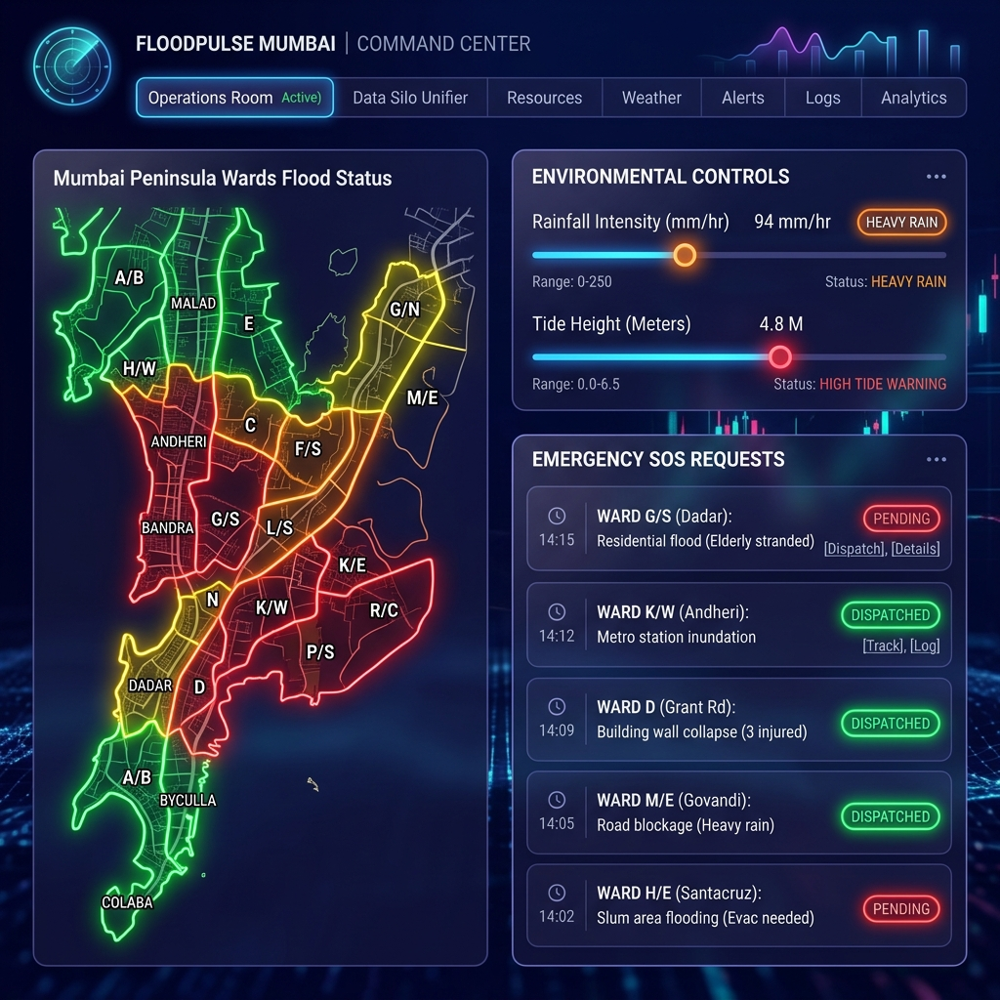
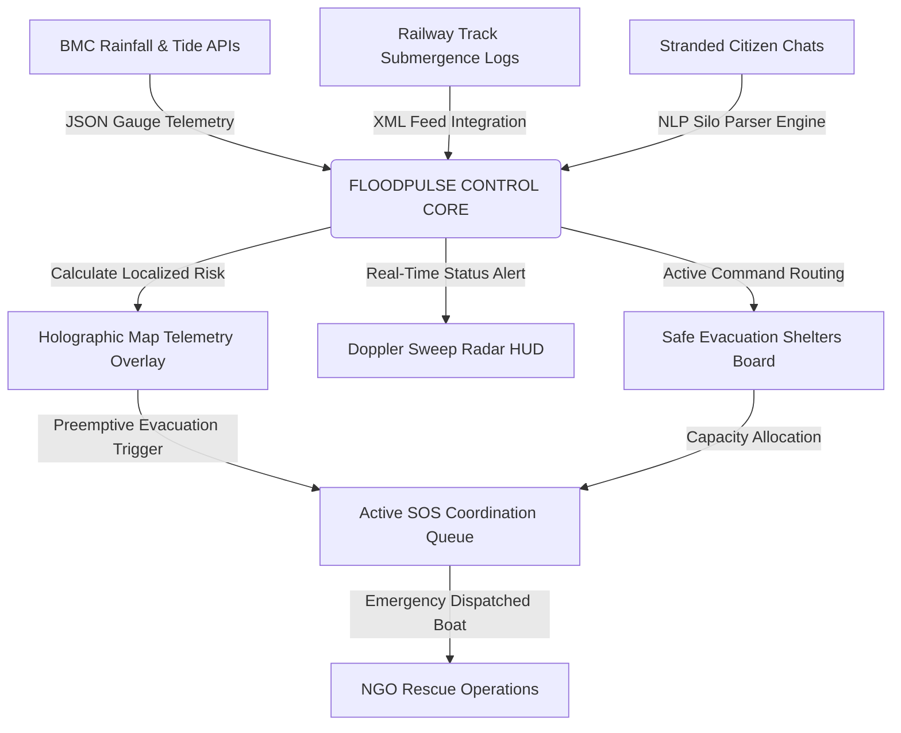

# FloodPulse Mumbai 🛰️🌊

> **The Next-Gen Predictive Flood Command, Ingestion Silo & Shelter Dispatch Portal**
> Designed for **The Blueprint Ideathon 2026** organized by **Rotaract Club of TCET** (Professional Development Avenue).
> Submission by **Pratyush Pandey** (Representative of Thakur College of Engineering & Technology).

[](https://pratyush-two.vercel.app)
[](https://vitejs.dev)
[](https://react.dev)
[](https://www.typescriptlang.org)

---

## 📸 Tactical Command Center Dashboard Showcase



---

## 🚀 Why FloodPulse Mumbai? (The Executive Pitch)

During extreme monsoon downpours in Mumbai, emergency operations suffer from **reactive delay**. This is fundamentally an **information coordination bottleneck**:
* **BMC** registers precipitation telemetry internally.
* **Railways** log track submergences manually, leading to stranded local trains.
* **NGOs** deploy rescue boats blindly based on hearsay.
* **Stranded Citizens** post emergency help requests in unstructured WhatsApp groups.

**FloodPulse Mumbai** breaks these administrative, transit, and volunteer silos by consolidating real-time gauge feeds, unstructured NLP parser results, and active shelters capacity status into a single **glassmorphic command center dashboard**.

---

## 🛠️ Complete System Architecture Flow



---

## ✨ Next-Generation Core Features

### 1. 🗺️ Interactive GIS Map & Holographic Telemetry HUD
* **Zero Tile-Server Dependency:** Custom SVG-polygon blueprint map representing Mumbai's coastal sub-wards ( Kurla to Dharavi) loading completely offline on low-bandwidth disaster channels.
* **Holographic POP-UP HUD:** Clicking on any ward launches an absolute-positioned floating telemetry console detailing elevation meters, active boats deployed, population weights, and localized danger index.
* **Preemptive Action Triggers:** Operators can instantly click **Dispatch Aid** to create a custom ticket pre-filled with ward coordinates, or **Radar Scan** to lock Doppler sweeps to that ward.

### 2. 📡 Radar sweep HUD & Diagnostics console
* **Technical Doppler Sweep:** Rebuilt SVG canvas featuring rotating conic sweeps, Compass degree ticks (0° N to 270° W), concentric HUD ranges, and target reticle storm zones.
* **Doppler Scan Progress Selector:** Control panel to customize sector targets and scan speeds with live progress bar loading cycles (0% to 100%).
* **Console File Downloader:** Extraction button to download system diagnostic audit trails as `.txt` files directly.

### 3. ⚓ Evacuation Shelter logistics & Emergency Dialer
* **Safe Shelter Occupancy Board:** Live tracking tables for major transit nodes showing active bed status, operational statuses (`OPEN`, `NEAR CAPACITY`, `FULL/CLOSED`), and local risk classifications.
* **Direct Call Dialers (`tel:` Links):**
  * Clickable `[Dial Victim]` triggers placed on each SOS request feed card.
  * Local BMC ward disaster cells hotlinks embedded inside map pop-ups.
  * Direct callback triggers next to NLP parsed citizen numbers.

### 4. 📈 Interactive Impact Simulator Slides (Judges' Choice)
* **Slideshow Slides Player:** Next-generation projector console with slide progress loaders, custom pill indicators, and autoplay loops (4.5s intervals).
* **Live response delay slider:** Interactive calculator showing how cutting response delays from 120 minutes down to 5 minutes drops estimated casualties to zero and spikes resource dispatch efficiency.

---

## 🔐 Role-Based Access Controls (RBAC) Flow

```mermaid
flowchart TD
    User([User Session]) --> Login{Select Access Role}
    Login -->|analyst@floodpulse.in| Analyst[Standard Analyst Clearance]
    Login -->|admin@floodpulse.in| Admin[Administrative Commander Clearance]
    
    Analyst -->|Read-Only| ViewOnly[GIS Map + Weather Radar View]
    
    Admin -->|Read & Write| FullControl[Modify Sliders + Ingest Silo NLP + Dispatch Boats + Manage User Directory]
```

---

## ⚙️ Build, Compile & Deploy Guide

Ensure you have **Node.js (v18+)** installed.

```bash
# Clone the repository
git clone https://github.com/PratyushPandey31/Hackthon-4.git
cd Hackthon-4

# Install dependencies
npm install

# Run Vite local dev server
npm run dev

# Compile TypeScript & Build Production Bundle
npm run build
```

---
*Developed for The Blueprint Ideathon. Submission by Thakur College of Engineering and Technology (TCET) Professional Development Avenue.*
